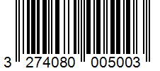
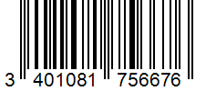
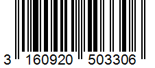

<h1 align="center">
  <br>
  
  <br>
  QuickScan
  <br>
</h1>

<h4 align="center">A Yuka alternative for non food products.</h4>

[](https://reactnative.dev/)
[](https://reactnative.dev/)

## 👨‍🏫 Presentation & Features

QuickScan is a mobile application that allows you to scan the barcode of a product and get some informations about it. It is a Yuka alternative for non food products made with React Native by a team of 3 students _(
Clément VERHILLE, Florentin LAMOUR & Mathys Pomier)_ in 4 days for a school project.


**Features** :
- Scan a barcode
- Get informations about the product
- Add the product to your favorites
- Search for a product by name or barcode
- Keep track of scanned products history

## 📦 Installation

### ⏮️ Requirements

- [Node.js](https://nodejs.org/en/)
- [Yarn](https://yarnpkg.com/)
- [Expo](https://expo.io/)
- [Expo Go](https://expo.io/tools#client) on your phone
- [Android Studio](https://developer.android.com/studio) or [XCode](https://developer.apple.com/xcode/) (for iOS)

### 📦 Installation

```bash
# Open a terminal in the project folder
$ yarn install
```

## Usage

### 🚀 Start the application

```bash
# Keep open the terminal in the project folder
$ yarn start
```

### 📱 Open the application on your phone

⚠️ **Warning** : If you want to use the application on your phone, you need to be connected to the same network as your computer.

- Download the Expo Go app on your phone
- Scan the QR code displayed in the terminal
- The application will open on your phone
- You can now use the application
- To stop the application, press `Ctrl + C` in the terminal
- To restart the application, repeat the steps above

If the QR code doesn't work, you can try to open the application on an emulator.

### Open the application on an emulator

- Like indicated in the terminal, press `a` to open the application on an Android emulator or `i` to open the application on an iOS emulator
- An emulator will open on your computer and the application will open on it
- If the application doesn't open on the emulator :
  - Find the Expo Go app on the emulator
  - Copy the URL displayed in the terminal (`exp://...`)
  - Paste the URL in the Expo Go app in "Enter the project URL manually"

## Some barcodes to test the application

### Macbook Pro : 


### Casque Sony WH-1000XM5 :


###  TV QLED Samsung QE85Q60B  :


## Others links
- [Figma Mockup](https://www.figma.com/file/QQvRIQfRBqP0V3aSHt9CCD/QuickScan---Maquette?node-id=0%3A1&t=7kJKHEaUxhyxeXgi-1)
- [Demo video]()
- [Kick-off & Retroplanning](https://ash-raincoat-a91.notion.site/S-minaire-React-Native-QuickScan-f15278e1030e48998b4d86f0f41b5cb4)


